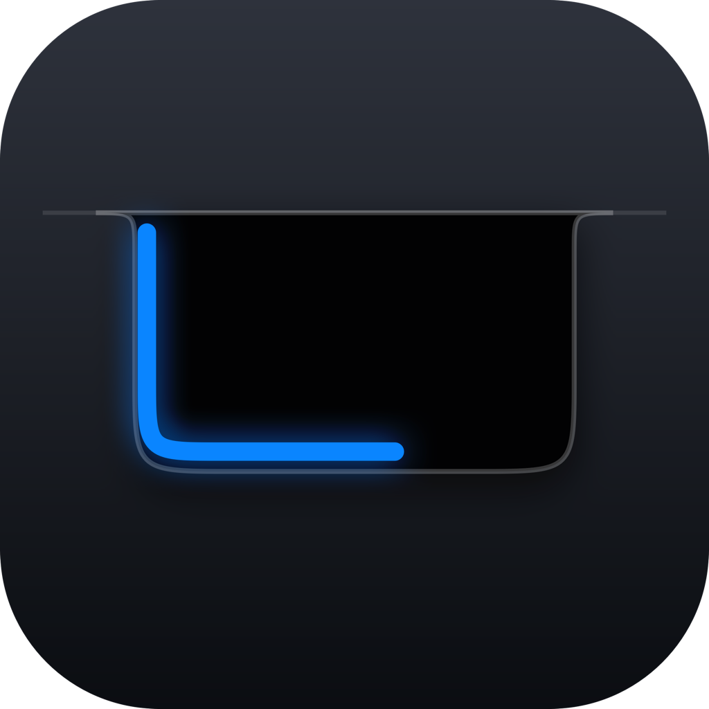
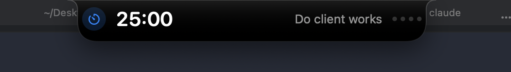
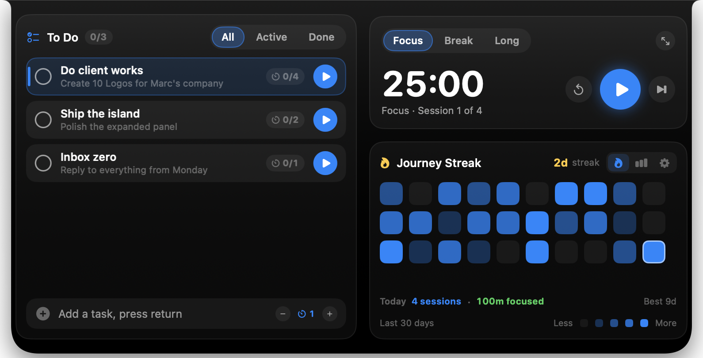

<p align="center">
  
</p>

<h1 align="center">Perch</h1>

<p align="center">
  A Dynamic Island for your Mac — including the Macs that never got one.<br>
  Pomodoro timer, to-do list and streaks, perched on the top edge of your screen.
</p>

<p align="center">
  
</p>

Perch hangs a black, bezel-welded island from the top edge of your display. Idle, it is
a pill with your Pomodoro timer and the task you are working on. Bring the pointer near
it and it springs open into a panel with your to-do list, your streak, your stats and
your settings. The hairline traced around its inner edge is the current phase — blue
for focus, green for a short break, purple for a long one.

Built with SwiftUI and AppKit. **No notch required:** the island is drawn, not detected,
so it works identically on Intel MacBooks, external displays and Apple silicon — and it
stays visible over full-screen apps.

<p align="center">
  
</p>

## Features

**Pomodoro, properly**
- Focus → short break → long break, with a configurable cycle (25 / 5 / 15, four
  sessions by default). Every duration is adjustable.
- Auto-start breaks, auto-start the next focus session, or neither.
- Skip, reset, or jump straight to a phase.
- The island can collapse itself when a session starts, so it stops being scenery.
- A chime and a notification when a phase ends.

**Tasks**
- Unlimited tasks in a scrolling list — add and delete as many as you like.
- Per-task Pomodoro estimates (`2/4`), counted up automatically as you finish sessions.
- Filter by All / Active / Done, and clear completed in one click.
- Drag to reorder, double-click to rename, right-click for the rest.
- The task you are focusing on carries a coloured spine so you can find it instantly.

**Journey Streak**
- A 30-day grid, one square per day, shaded by how many sessions you landed.
- Current streak, best streak, and today's totals.
- Hover any square for its date and count.

**Statistics**
- Sessions today, minutes focused today, current streak, all-time sessions.
- A seven-day bar chart of the week you have just had.

**Everywhere else**
- Menu-bar item with a live countdown while a session runs.
- Global hotkeys that need no Accessibility permission.
- Confetti when a focus session lands, because you earned it.
- Open at login.

## Requirements

- macOS 13 or later
- Swift 6 toolchain (Xcode 15+ command line tools)

## Run it

```bash
swift run
```

## Install it as a background app

```bash
./build_app.sh
open build/Perch.app
```

That produces `build/Perch.app`, an `LSUIElement` app: no Dock icon, just the island and
a menu-bar item. Drag it to `/Applications`, then turn on **Open at login** in the
island's Settings tab.

Notifications and *Open at login* need the bundled app — they are no-ops under
`swift run`, which has no bundle for the system to register.

## Using it

| Action | What happens |
| --- | --- |
| Move the pointer onto the pill | Springs open into the panel |
| Click anywhere in the panel | Keeps it open (it behaves like a popover) |
| Click outside, or the collapse button | Closes it |
| Play / pause on a task row | Starts a focus session for that task |
| Click the circle | Marks a task done |
| Click the `0/4` chip | Adds one to that task's estimate |
| Double-click a task | Rename it |
| Drag a task | Reorder |
| `×` on hover, or right-click → Delete | Removes a task |
| Type in "Add a task" + Return | Adds one, with the estimate shown beside it |
| Flame / chart / gear icons | Switch between streak, stats and settings |

### Global hotkeys

| Shortcut | Action |
| --- | --- |
| `⌃⌥Space` | Open / close the panel |
| `⌃⌥P` | Start / pause |
| `⌃⌥S` | Skip to the next phase |
| `⌃⌥R` | Reset the current phase |

Finishing a focus session banks it: the streak grid gets a square, the task's counter
goes up, and the confetti fires. A fresh install seeds a sample 30-day history so the
grid has something to show — **Reset all** in Settings wipes it and starts you at zero.

Everything is stored as JSON in `~/Library/Application Support/Perch/state.json`.

## Development

Shorten a session while working on the UI:

```bash
PB_SESSION_SECONDS=60 swift run
```

Redraw the icon and the logo after changing the mark:

```bash
swift Tools/MakeIcon.swift
iconutil -c icns Assets/AppIcon.iconset -o Assets/AppIcon.icns
```

### Layout of the source

| File | Role |
| --- | --- |
| `main.swift` | App delegate, panel placement, hit-testing, hotkeys, menu-bar item |
| `IslandPanel.swift` | The borderless panel that floats above the menu bar |
| `IslandView.swift` | The island body, the progress hairline, the collapsed pill |
| `ExpandedPanel.swift` | Timer transport, streak grid, statistics, settings |
| `TasksCard.swift` | The to-do list, its rows, drag-reorder and the add field |
| `Components.swift` | Cards, buttons, segmented controls, stat tiles |
| `Confetti.swift` | The burst fired when a session lands |
| `Store.swift` | Pomodoro engine, tasks, history, persistence |
| `Model.swift` | Phases, tasks, daily rollups, settings |
| `Theme.swift` | Every size, colour, font and spring in one place |
| `Shapes.swift` | The island silhouette and the progress hairline |
| `HotKeys.swift` | Carbon global hotkeys (no Accessibility permission needed) |
| `LoginItem.swift` | Open at login via `SMAppService` |

Three decisions worth knowing before you change them:

**The silhouette is inverted at the top.** The island's top edge runs the full width,
flush with the bezel, and flares *inward* through a pair of concave shoulders. That
inversion is what makes it read as carved out of the display instead of a rounded
rectangle parked near the top of the screen.

**The panel never resizes.** It is fixed at the expanded size and SwiftUI springs the
shape inside it, because animating an `NSWindow` resize is visibly choppy. Everything
outside the island body is kept click-through by polling the pointer and toggling
`ignoresMouseEvents`, so the desktop underneath stays usable.

**Hover is decided by that same poll, not by `.onHover`.** A pointer that lands on the
island in a single jump produces no further mouse-moved event while the window is
interactive, so SwiftUI would miss it — and clicking makes the panel key, which drops
SwiftUI's hover state right under the pointer.

## License

MIT — see [LICENSE](LICENSE).
