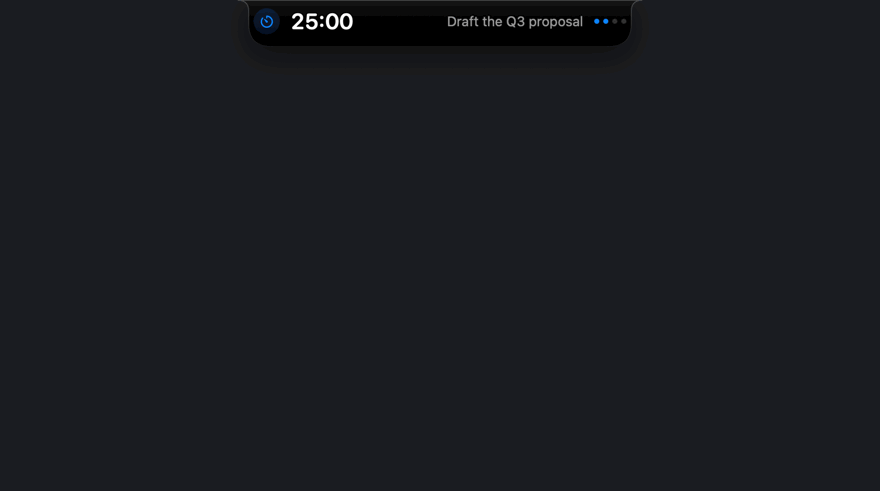
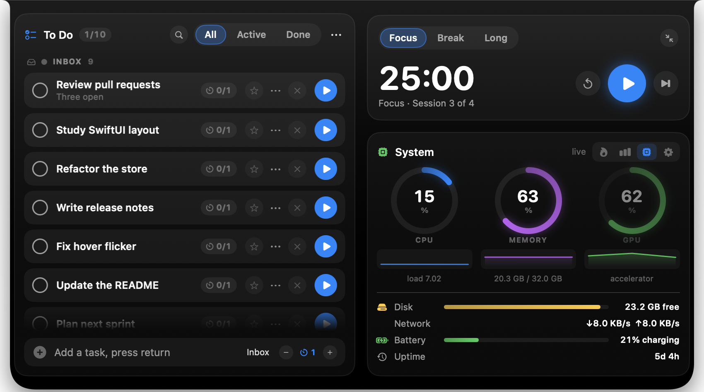

<p align="center">
  
</p>

<h1 align="center">Perch</h1>

<p align="center">
  A Dynamic Island for your Mac — including the Macs that never got one.<br>
  Pomodoro timer, grouped to-do list, streaks and a live system monitor,
  perched on the top edge of your screen.
</p>

<p align="center">
  
</p>

Perch hangs a black, bezel-welded island from the top edge of your display. Idle, it is
a pill with your Pomodoro timer and the task you are working on. Bring the pointer near
it and it springs open into a panel with your to-do list, your streak, your statistics,
a live system monitor and your settings. The hairline traced around its inner edge is
the current phase — your accent colour for focus, green for a short break, purple for a
long one.

Built with SwiftUI and AppKit. **No notch required:** the island is drawn, not detected,
so it works identically on Intel MacBooks, external displays and Apple silicon — and it
stays visible over full-screen apps. It is deliberately cheap: measured on an Intel
MacBook Pro, **0.011% of CPU and 33 MB** sitting idle, and **0.017%** with a session
running. Nothing is sampled while the panel is closed, and the pointer poll costs
nothing while the pointer is still.

<p align="center">
  
</p>

## Features

**Pomodoro, properly**
- Focus → short break → long break, with a configurable cycle (25 / 5 / 15, four
  sessions by default). Every duration is adjustable.
- Auto-start breaks, auto-start the next focus session, or neither.
- Skip, reset, or jump straight to a phase.
- The island collapses itself when a session starts, so it stops being scenery.
- A chime — Glass, Ping, Submarine or silence — and a notification when a phase ends.

**Tasks and groups**
- Unlimited tasks in a scrolling list. Add and delete as many as you like.
- Group them — *Client work*, *Study*, whatever you need — and collapse a group to get
  it out of the way. Deleting a group keeps its tasks; they fall back to the Inbox.
- Per-task Pomodoro estimates (`2/4`), counted up automatically as you finish sessions.
- Star a task to float it to the top. Filter by All / Active / Done, search across
  titles and notes, and clear completed in one click.
- Drag to reorder, double-click to rename, and a menu on every row for the rest.
- The task you are focusing on carries a coloured spine so you can find it instantly.

**Journey Streak**
- A 30-day grid, one square per day, shaded by how many sessions you landed.
- Daily goal, cycle progress and current-versus-best streak, all at a glance.
- Hover any square for its date and count.

**Statistics**
- Sessions today, minutes focused, current streak, all-time sessions.
- A seven-day bar chart, a by-hour histogram of when you actually focus, and a log of
  every session you finished today.

**System monitor**
- Live CPU, memory and GPU gauges with sparklines, plus disk, network, battery and
  uptime.
- **Click a gauge to see what is responsible.** The process explorer lists the top
  processes by CPU, memory or disk, with live percentages and rates.
- Everything is read straight from the kernel — `host_statistics`, `IOAccelerator`
  performance counters and `libproc` — with no shelling out and no polling while the
  panel is closed.

<p align="center">
  
</p>

**Everywhere else**
- Six accent colours, and the island can hang left, centre or right.
- Menu-bar item with a live countdown, and optionally live CPU load.
- Global hotkeys that need no Accessibility permission.
- Export your data as JSON, or reveal it in the Finder.
- Confetti when a focus session lands, because you earned it.
- Open at login.

## Install

Works on **Intel and Apple Silicon** — `build_app.sh` produces a universal binary, so the
same app runs natively on both.

```bash
git clone https://github.com/momenbuilds/perch.git
cd perch
./build_app.sh --install
```

That builds `Perch.app`, copies it to `/Applications` and launches it. It is an
`LSUIElement` app: no Dock icon, just the island and a menu-bar item. Turn on **Open at
login** in the island's Settings tab to have it there every morning.

| Command | What it does |
| --- | --- |
| `./build_app.sh` | Universal build into `build/Perch.app` |
| `./build_app.sh --native` | Only this machine's architecture — much faster to iterate |
| `./build_app.sh --install` | Build, install into `/Applications`, launch |
| `swift run` | Run straight from source |

Requires **macOS 13 or later** and the Swift 6 toolchain (Xcode 15+ command line tools —
`xcode-select --install`).

The app is signed ad-hoc rather than notarised, so the first launch may need
**right-click → Open** (or System Settings → Privacy & Security → Open Anyway).
Notifications and *Open at login* need the bundled app; they are no-ops under
`swift run`, which has no bundle for the system to register.

### The island is in my way

Click the menu-bar icon to tuck it away, click again to bring it back — or press
`⌃⌥H` from anywhere, which also works over full-screen apps where the menu bar itself is
hidden. You can also move it to the left or right edge in Settings.

## Using it

| Action | What happens |
| --- | --- |
| Move the pointer onto the pill | Springs open into the panel |
| Click anywhere in the panel | Keeps it open (it behaves like a popover) |
| Click outside, or press `esc` | Closes it |
| Menu-bar icon | Hides the island; click again to restore. Right-click for the menu |
| Play / pause on a task row | Starts a focus session for that task |
| Click the circle | Marks a task done |
| Click the `0/4` chip | Adds one to that task's estimate |
| Star | Floats the task to the top |
| `⋯` on a row | Rename, edit note, move to a group, delete |
| Double-click a task | Rename it |
| Drag a task | Reorder, or drop it into another group |
| `⋯` in the header | New group, system load, clear completed |
| Chevron on a group | Collapses it |
| Flame / chart / chip / gear | Streak, statistics, system, settings |

### Global hotkeys

| Shortcut | Action |
| --- | --- |
| `⌃⌥Space` | Open / close the panel |
| `⌃⌥H` | Hide the island / bring it back |
| `⌃⌥N` | Open it and start typing a new task |
| `⌃⌥P` | Start / pause |
| `⌃⌥S` | Skip to the next phase |
| `⌃⌥R` | Reset the current phase |

Finishing a focus session banks it: the streak grid gets a square, the task's counter
goes up, and the confetti fires. Nothing is seeded or faked — a fresh install starts
empty and every number you see is yours.

Everything is stored as JSON in `~/Library/Application Support/Perch/state.json`.

## Development

```bash
swift build                                   # build
PB_SESSION_SECONDS=60 swift run               # 60-second phases while working on the UI
swift Tools/MakeIcon.swift && \
  iconutil -c icns Assets/AppIcon.iconset -o Assets/AppIcon.icns   # redraw the mark
```

### Checks

The engine has a headless self-test — 117 assertions covering tasks, groups, sorting and
search, whole Pomodoro cycles including the long break, statistics, persistence
round-trips (and loading files written by older versions), formatting, and live system
metrics:

```bash
swift run Perch --selftest
```

It uses an in-memory store, so running it never touches your data. There is also an
offscreen renderer that writes each pane to a PNG without opening a window:

```bash
swift run Perch --render ./shots
```

And a recorder that drives the island through a scripted demo:

```bash
swift run Perch --demo          # a seeded island, parked off-screen
```

### Layout of the source

| File | Role |
| --- | --- |
| `main.swift` | App delegate, panel placement, hit-testing, hotkeys, menu-bar item |
| `IslandPanel.swift` | The borderless panel that floats above the menu bar |
| `IslandView.swift` | The island body, the progress hairline, the collapsed pill |
| `ExpandedPanel.swift` | Timer transport, streak grid, statistics, settings |
| `TasksCard.swift` | The to-do list, groups, rows, drag-reorder and the add field |
| `SystemCard.swift` | Gauges, meters and the process explorer |
| `SystemMonitor.swift` | CPU, memory, GPU, disk, network, battery and per-process sampling |
| `Components.swift` | Cards, buttons, segmented controls, gauges, sparklines |
| `Confetti.swift` | The burst fired when a session lands |
| `Store.swift` | Pomodoro engine, tasks, groups, history, persistence |
| `Model.swift` | Phases, tasks, groups, daily rollups, settings |
| `Theme.swift` | Every size, colour, font and spring in one place |
| `Shapes.swift` | The island silhouette and the progress hairline |
| `HotKeys.swift` | Carbon global hotkeys (no Accessibility permission needed) |
| `LoginItem.swift` | Open at login via `SMAppService` |
| `SelfTest.swift` / `PreviewRenderer.swift` | The headless harnesses |

Four decisions worth knowing before you change them:

**The silhouette is inverted at the top.** The island's top edge runs the full width,
flush with the bezel, and flares *inward* through a pair of concave shoulders. That
inversion is what makes it read as carved out of the display instead of a rounded
rectangle parked near the top of the screen.

**The panel never resizes.** It is fixed at the expanded size and SwiftUI springs the
shape inside it, because animating an `NSWindow` resize is visibly choppy. Everything
outside the island body is kept click-through by toggling `ignoresMouseEvents`.

**Hover is decided by a pointer poll, not `.onHover`.** macOS only delivers mouse-moved
events to apps that ask for them, so a global monitor silently misses the pointer
crossing another app's window. The poll costs nothing because it bails out the moment it
sees the pointer has not moved.

**No control hides behind hover.** SwiftUI does not deliver hover events at all while an
app is inactive, which an overlay panel always is, so every action on a row is visible
all the time.

## License

MIT — see [LICENSE](LICENSE).
